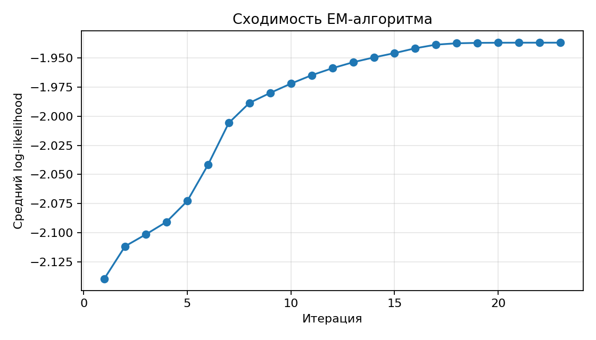
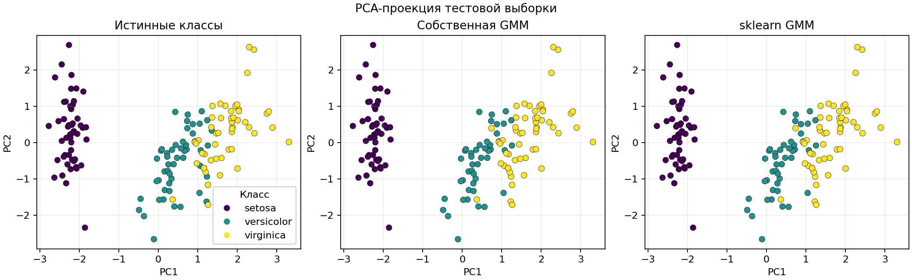

# Лабораторная работа №4. EM-алгоритм

## Задание

1. Выбрать датасет для восстановления плотности распределения.
2. Реализовать GMM.
3. Обучить модель на выбранном датасете.
4. Оценить качество модели через ПМП.
5. Сравнить результаты с эталонной реализацией из `scikit-learn`.
6. Подготовить отчет с описанием алгоритма, датасета, экспериментов, сравнения и выводов.

## Датасет

Использован Iris из `sklearn.datasets.load_iris`.

- Объекты: 150.
- Признаки: 4 числовых измерения чашелистиков и лепестков.
- Классы: `setosa`, `versicolor`, `virginica`, по 50 объектов каждого класса.
- Пропуски отсутствуют.

Датасет загружается во время выполнения скрипта, поэтому в репозитории не хранится отдельный файл с данными. Перед обучением признаки стандартизируются через `StandardScaler`.

## Структура проекта

```text
lab4/
├── README.md
├── artifacts/
│   ├── likelihood_curve.png
│   ├── metrics_comparison.png
│   ├── pca_clusters.png
│   ├── results.csv
│   └── run_summary.md
└── source/
    ├── __init__.py
    ├── gmm.py
    └── main.py
```

## Реализация

Собственная модель `GaussianMixtureEM` реализует Gaussian Mixture Model с полными ковариационными матрицами. Плотность задается как смесь многомерных нормальных распределений:

$$
p(x) = \sum_{k=1}^{K} \pi_k \mathcal{N}(x \mid \mu_k, \Sigma_k),
$$

где $\pi_k$ — вес компоненты, $\mu_k$ — среднее, $\Sigma_k$ — ковариационная матрица.

Параметры оцениваются EM-алгоритмом:

1. Инициализация средних через собственную реализацию k-means++ и несколько итераций k-means.
2. E-шаг: расчет ответственностей компонент в логарифмическом пространстве через `logaddexp`.
3. M-шаг: обновление весов, средних и полных ковариационных матриц по взвешенным статистикам.
4. Регуляризация ковариаций добавлением `reg_covar * I`.
5. Повторение до сходимости среднего log-likelihood или достижения `max_iter`.

Эталонная модель — `sklearn.mixture.GaussianMixture` с тем же числом компонент, `covariance_type="full"`, `n_init=10`, `tol=1e-5`.

## Наивный байесовский классификатор

Наивный байесовский классификатор выбирает класс с максимальной апостериорной вероятностью:

$$
\hat{y} = \arg\max_y P(y \mid x) = \arg\max_y P(y) p(x \mid y).
$$

Основное упрощение — предположение условной независимости признаков:

$$
p(x \mid y) = \prod_{j=1}^{d} p(x_j \mid y).
$$

Для числовых признаков часто используется Gaussian Naive Bayes, где каждый признак внутри класса описывается одномерным нормальным распределением. GMM тоже использует байесовское обновление вероятностей принадлежности к компонентам на E-шаге, но не предполагает независимость признаков и моделирует совместную плотность через многомерные ковариационные матрицы.

## Запуск

```sh
.venv/bin/python students/grechukha-gv/lab4/source/main.py
```

Если окружение еще не создано:

```sh
python3 -m venv .venv
.venv/bin/python -m pip install -r students/grechukha-gv/requirements.txt
```

## Результаты

Оценка проводилась на стандартизированном датасете Iris с `K=3`. Основная метрика ПМП — средний log-likelihood: чем значение выше, тем лучше модель описывает данные. Accuracy считается после оптимального сопоставления номеров компонент с истинными классами, так как GMM обучается без учителя и не фиксирует порядок компонент.

| Модель | Mean LL | BIC | AIC | Accuracy | ARI | Fit time, sec |
|--------|---------|-----|-----|----------|-----|---------------|
| Собственная GMM | -1.9369 | 801.53 | 669.06 | 0.9667 | 0.9039 | 0.134 |
| sklearn GMM | -1.9369 | 801.53 | 669.06 | 0.9667 | 0.9039 | 0.189 |


*Рис. 1. Сравнение log-likelihood, accuracy и ARI.*



*Рис. 2. Рост среднего log-likelihood по итерациям EM-алгоритма.*



*Рис. 3. PCA-проекция истинных классов и предсказаний GMM.*

## Анализ результатов

Собственная реализация достигла тех же значений log-likelihood, BIC, AIC, accuracy и ARI, что и эталонная модель `sklearn`. Это означает, что EM-алгоритм сошелся к тому же локальному максимуму правдоподобия. Небольшое преимущество по времени связано с малым размером датасета и узкой реализацией только нужного случая full-covariance GMM.

Ошибки возникают на границе классов `versicolor` и `virginica`: 5 объектов `versicolor` попали в компоненту `virginica`. Это ожидаемо для Iris, где эти два класса частично пересекаются в пространстве признаков.

## Выводы

1. Реализована GMM с EM-алгоритмом, полной ковариацией, регуляризацией и несколькими инициализациями.
2. Модель обучена на числовом датасете Iris и оценена по принципу максимума правдоподобия.
3. Собственная реализация полностью совпала с `sklearn.mixture.GaussianMixture` по качеству восстановления плотности и кластеризации.
