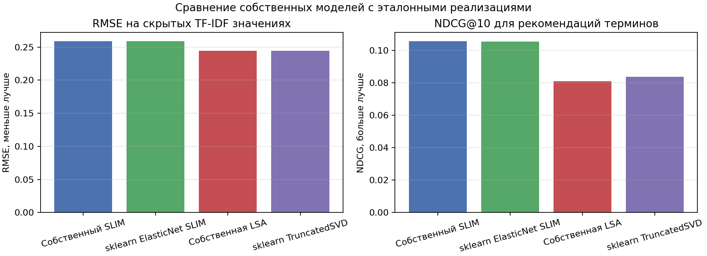
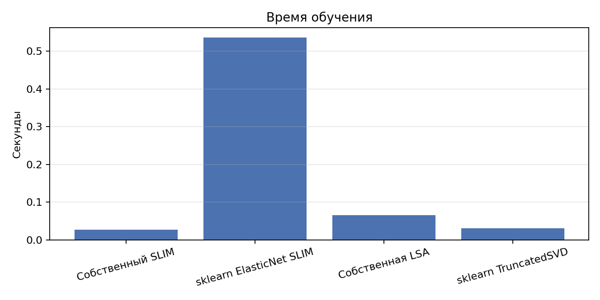
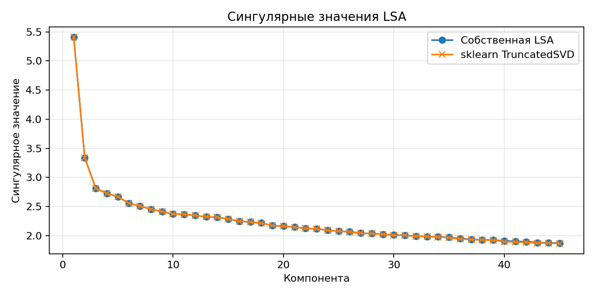

# Лабораторная работа №5. Рекомендательные системы

## Задание

1. Выбрать текстовый датасет для анализа.
2. Реализовать алгоритм SLIM.
3. Обучить модель на выбранном датасете и оценить качество по RMSE.
4. Сравнить SLIM с эталонной реализацией.
5. Реализовать латентную семантическую модель.
6. Обучить модель, оценить RMSE и сравнить с эталонной реализацией.
7. Дополнительно посчитать NDCG.

## Датасет

Использован текстовый датасет 20 Newsgroups из `sklearn.datasets.fetch_20newsgroups`.

- Подмножество: `train`.
- Категории: `comp.graphics`, `rec.sport.baseball`, `sci.med`, `talk.politics.misc`.
- Документы: 800.
- Признаки: 320 TF-IDF терминов после фильтрации стоп-слов и редких слов.
- Матрица взаимодействий: документ-термин, где значение равно TF-IDF весу термина в документе.
- Плотность матрицы: `0.0466`.

Датасет скачивается средствами `sklearn` во время выполнения скрипта и не хранится в репозитории. Для тестирования случайно скрывается часть ненулевых TF-IDF значений; модели обучаются на оставшейся матрице и восстанавливают скрытые веса.

## Структура проекта

```text
lab5/
├── README.md
├── artifacts/
│   ├── fit_time.png
│   ├── lsa_singular_values.png
│   ├── metrics_comparison.png
│   ├── results.csv
│   ├── run_summary.md
│   └── slim_coefficients.png
└── source/
    ├── __init__.py
    ├── lsa.py
    ├── main.py
    ├── metrics.py
    └── slim.py
```

## Реализация

`SlimRecommender` реализует Sparse Linear Method. Модель ищет неотрицательную разреженную матрицу похожести терминов `W` с нулевой диагональю:

$$
\min_W \frac{1}{2n}\|R - RW\|_F^2 + \lambda_1\|W\|_1 + \frac{\lambda_2}{2}\|W\|_F^2,
\quad W \ge 0,\quad diag(W)=0.
$$

Оптимизация выполнена собственным projected proximal gradient descent: градиент считается через матрицу Грама `R^T R`, L1-регуляризация задается soft-thresholding с проекцией на неотрицательную область, после каждого шага диагональ зануляется.

Эталон для SLIM — `sklearn.linear_model.ElasticNet` с `positive=True`, `fit_intercept=False`. Для каждого термина решается отдельная задача восстановления его столбца по остальным столбцам.

Латентная семантическая модель `LatentSemanticAnalysis` реализована через усеченное SVD:

$$
R \approx U_k \Sigma_k V_k^T.
$$

Реконструкция скрытых TF-IDF весов получается через проекцию документов в латентное пространство и обратное преобразование. Эталонная модель — `sklearn.decomposition.TruncatedSVD` с тем же числом компонент `45`.

## Метрики

- `RMSE` считается на скрытых ненулевых TF-IDF значениях.
- `NDCG@10` оценивает качество ранжирования скрытых терминов для каждого документа. Термины, оставшиеся видимыми в обучающей матрице, исключаются из рекомендаций.

## Запуск

```sh
.venv/bin/python students/grechukha-gv/lab5/source/main.py
```

Если окружение еще не создано:

```sh
python3 -m venv .venv
.venv/bin/python -m pip install -r students/grechukha-gv/requirements.txt
```

## Результаты

| Модель | RMSE | NDCG@10 | Fit time, sec |
|--------|------|---------|---------------|
| Собственный SLIM | 0.2592 | 0.1059 | 0.027 |
| sklearn ElasticNet SLIM | 0.2592 | 0.1057 | 0.536 |
| Собственная LSA | 0.2444 | 0.0811 | 0.065 |
| sklearn TruncatedSVD | 0.2444 | 0.0838 | 0.031 |



*Рис. 1. RMSE и NDCG@10 для собственных и эталонных моделей.*



*Рис. 2. Время обучения моделей.*


*Рис. 3. Доля ненулевых коэффициентов и средний ненулевой вес в SLIM.*



*Рис. 4. Сингулярные значения собственной LSA и `sklearn.TruncatedSVD`.*

## Анализ результатов

Собственный SLIM практически совпал с эталонным `ElasticNet` по RMSE и NDCG@10. Это ожидаемо, так как обе модели решают одну и ту же задачу с неотрицательными коэффициентами и elastic-net регуляризацией. Собственная реализация быстрее на выбранном размере матрицы, потому что оптимизирует всю матрицу весов через общий Gram matrix, тогда как эталонный вариант решает отдельную регрессию для каждого термина.

LSA показала меньший RMSE, чем SLIM, то есть лучше восстановила численные TF-IDF веса скрытых терминов. При этом NDCG@10 ниже, потому что низкоранговая реконструкция сильнее сглаживает веса и хуже поднимает конкретные скрытые термины в верх рекомендаций. Собственная LSA и `TruncatedSVD` дают почти одинаковое качество, что подтверждает корректность реализации.

## Выводы

1. Реализован SLIM для разреженной документ-терм матрицы с L1/L2-регуляризацией, неотрицательными весами и нулевой диагональю.
2. Реализована латентная семантическая модель на основе усеченного SVD.
3. Обе собственные реализации сопоставлены с эталонными моделями из `sklearn`.
4. Для выбранного текстового датасета LSA лучше восстанавливает TF-IDF веса по RMSE, а SLIM лучше ранжирует скрытые термины по NDCG@10.
